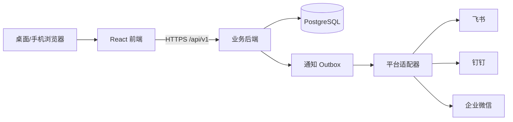

# 技术架构与数据设计

本文件是实施方案；尚未完成编码或对接验证。首期按独立业务应用交付，不能依赖飞书 aPaaS 才能运行。

## 1. 技术选型与目录

拟定：`frontend/` 用 React + TypeScript + Vite 构建响应式 Web/H5；`backend/` 用 NestJS + TypeScript 提供 REST API；PostgreSQL 保存业务数据；Prisma 管理模型与迁移。实现时锁定具体版本并记录在 lockfile，先用一个数据库和一个后端部署单元，避免为了“平台化”引入额外服务。文件附件、队列与缓存仅在真实需求出现时加入。

后端模块建议为 `auth`、`organization`、`lead`、`customer`、`opportunity`、`activity`、`task`、`report`、`integration`、`audit`。每个模块从控制器到服务、数据访问与测试独立，跨模块通过应用服务而不是互相直接改表。

## 2. 主要数据表

所有业务表含不可变 `id`、`tenant_id`、`created_at`、`updated_at`，必要时含 `deleted_at` 和 `version`。ID 为服务端生成的 UUID；公开编号另设可读字段。金额用 `numeric(18,2)` + `currency`，时间在库中存 UTC，按租户时区展示。

| 表/实体 | 关键字段 | 约束与关系 |
| --- | --- | --- |
| `tenants` | name, timezone, status | 每家企业独立租户；首期可仅部署一个租户 |
| `users`, `memberships`, `org_units` | user identity, role, org, enabled | 同一用户可归属多个组织/角色；禁用后会话失效 |
| `external_identities`, `platform_connections` | platform, external_user_id, app config ref | 外部 ID 按租户+平台+应用唯一；密钥仅存安全配置引用 |
| `leads` | name, contact, source, status, owner_id, org_id, duplicate_group, version | 归属变更与状态变更走业务服务；联系方式按权限读取 |
| `lead_assignments` | lead_id, from_user, to_user, reason, strategy | 追加式记录，能追溯人工/自动分配 |
| `conversion_requests` | lead_id, requested_by, reviewed_by, status, reason | 每条线索仅允许一个待审核申请；审核决定追加审计 |
| `customers` | name, normalized_name, registration_id, owner_id, source_lead_id | 租户内注册标识唯一（有值时）；名称相似只提示候选 |
| `contacts` | customer_id, name, phone, email, title | 从属于客户；变更审计 |
| `opportunities` | customer_id, owner_id, stage, amount, probability, expected_close_at, version | 终态变更要求日期/原因；参与人独立关联表 |
| `follow_ups` | target_type, target_id, author_id, content, occurred_at, next_at | 仅允许指向同租户线索、客户或商机 |
| `tasks`, `notifications` | target, assignee, due_at, delivery_status | 应用内待办与平台发送状态分开 |
| `outbox_events`, `inbound_events` | event_type, payload, dedupe_key, attempts, status | 外发重试与回调去重；同租户 dedupe_key 唯一 |
| `audit_logs` | actor, action, resource, before/after, request_id | 追加式；敏感信息脱敏或仅存摘要 |
| `idempotency_keys` | actor, key, request_hash, response_ref, expires_at | 防止重复转化、重复创建等 |

删除策略：业务记录默认软删除并保留引用，物理清理需另定保留期限与审批；审计事件、分配事件不得通过普通业务接口删除。

## 3. 业务事务和并发

1. 分配：验证候选销售和所属组织，事务中锁定线索及轮转位置，更新 owner/status/version，写 `lead_assignments`、`audit_logs`、`outbox_events`。并发冲突返回 409，前端刷新后重试。
2. 转化：先建立申请并审核（如该租户启用审核）；事务中校验 `conversion_approved` 且用户有权，查询/创建客户与联系人、可选商机，写线索转换结果及事件。以线索 ID + 操作种类建立唯一约束；幂等重试返回首次结果。关闭审核时由有转化权限者在 `qualified` 状态直接执行。
3. 商机阶段：按当前版本执行允许的迁移；赢/输单校验必需字段；写审计与待办变更。
4. 外部通知：业务事务只写 outbox；后台工作进程异步发送、指数退避重试并记录平台响应。超过上限进入人工可见失败队列，不伪称已送达。

## 4. 身份、权限与集成

- 独立部署使用系统内管理员创建账号和密码登录，成员可凭当前密码自助修改密码并撤销全部会话；忘记管理员密码可由部署者执行本地重置命令。密码使用成熟哈希算法，会话保存在 `HttpOnly`、`SameSite` Cookie 中；本机 HTTP 设置 `Secure=false`，公网 HTTPS 必须启用 `Secure`。不得在前端或仓库保存凭证。
- 数据访问先校验租户，再校验角色、组织范围与记录负责人/参与人。列表查询和详情查询都在数据库查询层加入权限过滤，导出和报表沿用同一规则。
- 未来平台登录统一映射到本地 `user_id`，不能把飞书/钉钉/企微的 user ID 直接用作业务主键。用户初次关联需按可信授权流程确认，不凭同名自动合并。
- `IdentityProvider`、`DirectoryProvider`、`MessageProvider`、`TodoProvider` 接口由平台适配器实现；未配置能力明确显示“未接入”，不可静默降级为假成功。
- 企业授权/回调/权限范围、速率与收费以开发当时三家官方文档和租户实际权限为准。每种平台分别完成真实授权、回调签名/加解密校验、令牌刷新、限流、重试、撤权处理后才标记可用。
- 初始集成顺序：平台登录 → 人员/组织同步 → 业务消息 → 待办；平台原生审批、群聊和文档后置。应用内待办不依赖任何办公平台。

## 5. 运行与安全基线

- 环境分 `development`、`staging`、`production`；配置由环境变量或密钥服务注入，仓库只存 `.env.example`。数据库迁移要可回滚或提供恢复方案。
- API 统一请求 ID、结构化日志、错误码；不得记录密码、token、完整联系方式、消息密文。
- 备份 PostgreSQL 并定期做恢复演练；生产部署要有健康检查、数据库连接检查和迁移门禁。
- 指标至少包含 API 错误率、线索分配失败、转化冲突、outbox 积压和外部平台发送失败；告警只发送必要摘要。
- 涉及联系方式、客户数据的权限与保留期限在上线前由实际使用企业确认。

## 6. AI 助手数据与权限

`AiConversation` 按租户、用户和业务上下文存储最近 20 条消息，用户可删除自己的对话。AI 服务经现有 CRM 服务读取线索、客户、商机和跟进，不把电话、邮箱、统一标识传给模型。结构化跟进草稿在审计日志中记录操作者、对象、模型及业务数据快照哈希；原始跟进仍须通过既有表单和权限校验保存。模型密钥仅在后端环境变量中，未配置时返回 503，不生成模拟建议。真实模型的数据处理、保留期和质量仍需上线前验收。
